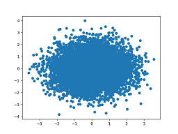
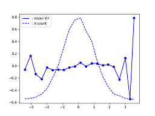

# Common

### 1. show_images
Example: huicv/demo/demo_vis.py

#### matplitlib

```python
from huicv.visualization import show_images
import numpy as np

images = [np.random.rand(200, 300, 3) for _ in range(3)]

# show multiple images
show_images(images)

# set layout with mxn and titles
show_images(images, mxn=(1, 3), titles=['figure1', 'figure2', 'figure3'])


def plot_func(idx, ax):
    ax.set_title(f"figure {idx}")


# define yours plot func
show_images(images, plot_func=plot_func)
```

#### PIL.Image

```py
from huicv.visualization import draw_pil_bbox
draw_pil_bbox(render_image, bboxes, cats, fill=True)
```

```py
import huicv.visualization as huivis

gid_img = huivis.grid_pil_images([pil_img1, pil_img2, pil_img3], 3, 1)
plt.imshow(grid_img)
```

#### show_on_web

```py
import huicv.visualization.web_vis as hui_web_vis

save_dir = "/apdcephfs_cq9/share_1447896/lucienymliu/html/xuehuiyu/layout/html/"

img_dir_dict = {
    "底图": f"../image_canvas/",  # relative to 
    "元素": f"../image_elems/",
    "混元生成图":f"../image_gen_{hunyuan_vlm_infer.model_name}/",
    "llava生成图": f"../image_gen_{llava_vlm_infer.model_name}/", 
    "intervl生成图": f"../image_gen_{intervl_vlm_infer.model_name}/", 
    "原图":f"../image_origin/",
}
range=(0, 100)
image_urs_list, column_names = hui_web_vis.get_image_urls(img_dir_dict, ".", image_root=save_dir, show_range=range)
html = hui_web_vis.build_image_table_html(image_urs_list, column_names, template_id=1)

html_path = f'{save_dir}/1.html'
os.makedirs(os.path.split(html_path)[0], exist_ok=True)
with open(html_path, 'w') as f:
    f.write(html)

import random
print(f"http://{your_server_ip}/lucienymliu/html/xuehuiyu/layout/html/1.html?{random.randint(0, 60000)}")
```


### 2. show with coco

```py
from pycocotools.coco import COCO
import huicv.visualization as huivis
coco = COCO(ann_file)
img_root = 'data/images'
huivis.show_image_set_with_anns(coco, img_root, image_number_or_ids=10)
```

## Analysis
### 2. find out the relation between two data X, Y

> 判断两组数据是否相关，比如CPR估计的尺度和目标的真实尺度是否相关，每个尺度区间的误差一致吗？
> 对于数据较少的情况画散点图就够了，但是对于目标较多的情况散点图看不出密度，因此需要密度热图
> 密度热图没有具体的数字，不好看出每个尺度范围内的误差，因此需要平均直方图

```python
import numpy as np
import matplotlib.pyplot as plt
from huicv.visualization.analysis import show_density_as_heatmap, show_meanY_and_density_of_Xbins
data_a, data_b = np.random.randn(2, 10000)

# 散点图，只能画出来点，但是重叠严重的地方看不出密度，对密度的可视化效果很差
plt.scatter(data_a, data_b)
plt.show()
# show distribution density of (a, b) \in (data_a, data_b)
show_density_as_heatmap(data_a, data_b, (50, 50))
# bins X, 用于查看X,Y是否相关
show_meanY_and_density_of_Xbins(data_a, data_b)
```

> 散点图很难看出分布来
> 密度热图可以看到点对只要集中在(0, 0)附近
> 从mean:X-Y可以看到Y的均值与X无关




